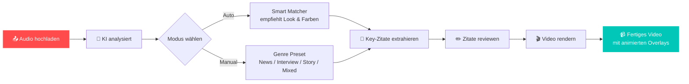

<div align="center">

<br>

```
╔══════════════════════════════════════════════════════════════════════╗
║                                                                      ║
║           🎵    A U D I O   V I S U A L I Z E R   P R O    ✨        ║
║                                                                      ║
╚══════════════════════════════════════════════════════════════════════╝
```

<h1>Audio Visualizer Pro</h1>

<p><strong>Transformiere Audio in atemberaubende Visuals.</strong><br>
KI-gestützt. GPU-beschleunigt. Für Musikvideos, Podcasts & Creative Coding.</p>

<p>
  <a href="#-schnellstart"></a>
  <a href="#-demo"></a>
  <a href="#-dokumentation"></a>
</p>

<p>
  
  
  
  
  
  
</p>

<br>

</div>

---

## 📋 Inhaltsverzeichnis

- [🎬 Demo](#-demo)
- [✨ Features](#-features)
- [🚀 Schnellstart](#-schnellstart)
- [🏗️ Architektur](#-architektur)
- [🎨 Visualizer](#-visualizer)
- [🎙️ Podcast-Workflow](#-podcast-workflow)
- [🤖 KI-Auto-Modus](#-ki-auto-modus)
- [⚙️ Konfiguration](#-konfiguration)
- [🧪 Tests](#-tests)
- [📁 Projektstruktur](#-projektstruktur)
- [🔧 System-Voraussetzungen](#-system-voraussetzungen)
- [🛣️ Roadmap](#-roadmap)
- [🤝 Mitmachen](#-mitmachen)
- [📄 Lizenz](#-lizenz)

---

## 🎬 Demo

<div align="center">

### 🎵 Musik-Visualizer in Aktion

> *Lade ein Audio hoch, wähle einen Look und sieh sofort das Ergebnis — dank GPU-beschleunigter Live-Vorschau.*

<br>

| 🎨 **Pulsing Core** | 📊 **Spectrum Bars** | 🌸 **Frequency Flower** |
|:---:|:---:|:---:|
| 🔴⭕🔴 Pulsierender Beat-Kern | ▁▂▃▅▇ Klassischer Equalizer | 🌺 Organische Blüten-Animation |
| *EDM, Pop, Trap* | *Rock, Hip-Hop, Metal* | *Indie, Folk, Pop* |

<br>

| 💥 **Particle Swarm** | 🫧 **Liquid Blobs** | 🔯 **Sacred Mandala** |
|:---:|:---:|:---:|
| 💥✨💥 Explosive Partikel | 🫧🫧🫧 Flüssige MetaBalls | 🔯🕉️🔯 Heilige Geometrie |
| *Dubstep, Trap, DnB* | *House, Techno, Deep* | *Meditation, Ambient* |

<br>

**🚀 So einfach geht's:**

```bash
# 1. GUI starten
python start_gui.py

# 2. Audio hochladen → Live-Vorschau erscheint sofort
# 3. Look wählen → Farben anpassen → Video rendern
```

</div>

---

## ✨ Features

<div align="center">

<table>
<tr>
<td width="33%" align="center">

### 🤖 KI-Auto-Modus
Die KI analysiert dein Audio und empfiehlt **automatisch** den perfekten Visualizer, die passende Farbpalette und optimale Parameter.

</td>
<td width="33%" align="center">

### 🎨 16 GPU-Visualizer
Von minimalistisch bis psychedelisch — alle Visualizer nutzen **Hardware-beschleunigtes OpenGL-Rendering** für flüssige 60fps.

</td>
<td width="33%" align="center">

### 💬 KI-Zitat-Overlays
Gemini extrahiert automatisch die besten **Key-Zitate** aus deinem Audio. Editierbar, zeitbasiert, animiert.

</td>
</tr>
<tr>
<td width="33%" align="center">

### ⚡ Aggressives Caching
Audio-Analyse wird **einmalig** durchgeführt und gecached. Millionen Renders ohne Wartezeit.

</td>
<td width="33%" align="center">

### 🎙️ Podcast-Presets
Speziell abgestimmte Presets für **News, Interview, Storytelling & Mixed** — mit optimierten Zitat-Overlays.

</td>
<td width="33%" align="center">

### 🖥️ Streamlit-GUI
Keine Kommandozeile nötig. **Drag & Drop**, Live-Preview, One-Click-Render — alles im Browser.

</td>
</tr>
</table>

</div>

---

## 🚀 Schnellstart

### Installation

```bash
# 1. Repository klonen
git clone https://github.com/dein-user/audio_visualizer_pro.git
cd audio_visualizer_pro

# 2. Abhängigkeiten installieren
pip install -r requirements.txt

# 3. FFmpeg installieren (system-seitig)
# Ubuntu:  sudo apt-get install ffmpeg
# macOS:   brew install ffmpeg
# Windows: https://ffmpeg.org/download.html
```

### Option A: GUI starten (Empfohlen)

```bash
# Windows
double-click start_gui.bat

# Oder überall
python start_gui.py
```

Öffnet automatisch **[http://localhost:8501](http://localhost:8501)** im Browser.

### Option B: Kommandozeile

```bash
# 5-Sekunden Vorschau rendern
python main.py render song.mp3 --visual pulsing_core --preview

# Volles Video mit KI-Empfehlung
python main.py render podcast.mp3 --config config/auto_recommended.json -o output.mp4

# Alle verfügbaren Visualizer anzeigen
python main.py list-visuals
```

---

## 🏗️ Architektur


**Technologie-Stack:**

| Layer | Bibliothek | Zweck |
|-------|-----------|-------|
| Audio-Analyse | `librosa` | Feature-Extraktion (RMS, Onset, Chroma, Beat-Frames) |
| GPU-Rendering | `moderngl` | OpenGL Shader-Pipeline für 60fps Visuals |
| Text-Rendering | `Pillow` + GPU | Schriftarten, Zitat-Overlays |
| Video-Encoding | `FFmpeg` | libx264 + AAC, Hardware-Encode optional |
| Datenvalidierung | `pydantic` | Config-Models & Feature-Schemas |
| GUI | `streamlit` | Web-Oberfläche mit Live-Preview |
| KI | `Google Gemini` | Zitat-Extraktion & Smart Matching |

---

## 🎨 Visualizer

<div align="center">

### 🎵 Musik-Visuals

| Visualizer | Preview | Beschreibung | Genre | Key-Parameter |
|------------|---------|--------------|-------|---------------|
| `pulsing_core` | 🔴⭕🔴 | Pulsierender Kern mit Beat-Reaktion | EDM, Pop, Trap | `pulse_intensity`, `glow_layers` |
| `spectrum_bars` | ▁▂▃▅▇ | Klassischer 40-Balken Equalizer | Rock, Hip-Hop | `bar_count`, `smoothing` |
| `chroma_field` | ✨✨✨ | Partikel-Feld basierend auf Tonart | Ambient, Jazz | `field_resolution` |
| `particle_swarm` | 💥✨💥 | Physik-basierte Partikel-Explosionen | Dubstep, Trap | `particle_count`, `explosion_threshold` |
| `neon_oscilloscope` | ﹋﹋﹋ | Retro-futuristischer Oszilloskop | Synthwave, Cyberpunk | `line_thickness`, `trail_length` |
| `liquid_blobs` | 🫧🫧🫧 | Flüssige MetaBall-Blob-Animation | House, Techno | `blob_count`, `fluidity` |
| `neon_wave_circle` | ⭕〰️⭕ | Konzentrische Neon-Ringe mit Wellen | EDM, Techno | `circle_count`, `wave_amplitude` |
| `frequency_flower` | 🌸🌺🌸 | Organische Blumen mit Audio-Blütenblättern | Indie, Folk, Pop | `num_petals`, `layer_count` |
| `bass_temple` | 🔲🔳🔲 | Bass-getriebener Tempel-Look | Drum & Bass | `bass_reactivity`, `temple_size` |
| `lumina_core` | 💡✨💡 | Leuchtender Kern mit Flare-Effekten | Cinematic Pop | `flare_intensity`, `core_glow` |
| `orchestral_swell` | 🎻🌊🎻 | Schwelgende Orchester-Visuals | Klassik, Film | `swell_speed`, `orchestra_depth` |
| `spectrum_genesis` | 🌌🌠🌌 | Kosmischer Spectrum-Genesis-Stil | Sci-Fi, Ambient | `star_density`, `genesis_speed` |

### 🎙️ Sprach-Visuals

| Visualizer | Preview | Beschreibung | Genre | Key-Parameter |
|------------|---------|--------------|-------|---------------|
| `typographic` | 𝚃𝚎𝚡𝚝 | Minimalistisch mit Wellenform-Text | Podcasts, News | `text_size`, `animation_speed` |
| `speech_focus` | 🎙️📢🎙️ | Fokussierte Sprach-Visualisierung | Podcasts, News | `focus_radius`, `speech_color` |
| `voice_flow` | 〰️🎙️〰️ | Fließende Voice-Wellen-Animation | Storytelling | `flow_speed`, `wave_smoothness` |
| `sacred_mandala` | 🔯🕉️🔯 | Heilige Geometrie mit Rotation | Meditation, Ambient | `rotation_speed`, `sacred_depth` |

</div>

---

## 🎙️ Podcast-Workflow



### Zitat-Overlay-Features

- ⏱️ **Zeitbasiert**: Erscheint bei `start_time`, verschwindet bei `end_time`
- ✨ **Animiert**: Fade-In/Out, Slide-In (up/down/left/right), Scale-In, Glow-Pulse
- 🎨 **Stilvoll**: Abgerundete Box mit Schatten, Auto-Skalierung, Zeilenabstand
- ✏️ **Editierbar**: Vor dem Rendering im GUI bearbeiten, deaktivieren, neu anordnen
- 🔤 **Eigene Schriftarten**: `.ttf`-Upload für Custom Branding

---

## 🤖 KI-Auto-Modus

Der **Smart Matcher** analysiert dein Audio und generiert eine optimierte Config:

```bash
# GUI: "Auto-Modus (KI empfiehlt)" wählen
# CLI: Mit generierter Config rendern
python main.py render podcast.mp3 --config config/auto_recommended.json --preview
```

### Was die KI analysiert

| Feature | Bedeutung | Einfluss |
|---------|-----------|----------|
| **RMS-Verteilung** | Lautstärke-Dynamik | Opazität, Partikel-Intensität |
| **Onset-Rate** | Beat-Dichte | Trigger-Schwellen, Animationsgeschwindigkeit |
| **Tempo (BPM)** | Geschwindigkeit | Rotationsgeschwindigkeit, Flow-Rate |
| **Key & Mode** | Tonart & Stimmung | Farbpalette (warm/kalt/hell/dunkel) |
| **Voice-Clarity** | Sprach-Anteil | Visualizer-Auswahl (Sprache vs. Musik) |

### Was die KI empfiehlt

- 🎨 **Besten Visualizer**: `speech_focus` für Sprache, `spectrum_bars` für Musik
- 🌈 **Farbpalette**: Passend zum erkannten Key (z.B. C-Dur = warme Oranges)
- ⚙️ **Parameter**: Partikel-Anzahl, Geschwindigkeit, Glow-Intensität

---

## ⚙️ Konfiguration

### Beispiel-Config erstellen

```bash
python main.py create-config --output meine_config.json
```

### Vollständige Config-Struktur

```json
{
  "audio_file": "song.mp3",
  "output_file": "output.mp4",
  "visual": {
    "type": "pulsing_core",
    "resolution": [1920, 1080],
    "fps": 60,
    "colors": {
      "primary": "#FF0055",
      "secondary": "#00CCFF",
      "background": "#0A0A0A",
      "accent": "#FFAA00"
    },
    "params": {
      "pulse_intensity": 0.8,
      "glow_layers": 3,
      "glow_radius": 20
    }
  },
  "postprocess": {
    "contrast": 1.1,
    "saturation": 1.2,
    "brightness": 0.0,
    "warmth": 0.1,
    "film_grain": 0.05,
    "vignette": 0.3,
    "chromatic_aberration": 0.02
  },
  "quotes": [
    {
      "text": "Das ist ein Key-Zitat aus dem Audio!",
      "start_time": 10.5,
      "end_time": 15.2,
      "confidence": 0.95
    }
  ],
  "background_image": null,
  "background_blur": 0.0,
  "background_vignette": 0.0,
  "background_opacity": 0.3
}
```

---

## 🧪 Tests

```bash
# Alle Tests ausführen (42 Tests)
pytest tests/ -v

# Spezifische Test-Suites
pytest tests/test_visuals.py -v       # GPU-Visualisierung
pytest tests/test_analyzer.py -v      # Audio-Feature-Extraktion
pytest tests/test_ai_matcher.py -v    # KI-Empfehlungen
pytest tests/test_quote_overlay.py -v # Text-Overlays
pytest tests/test_gemini_integration.py -v # KI-Integration
```

---

## 📁 Projektstruktur

```
audio_visualizer_pro/
├── 📂 config/                      # 14 Konfigurations-Presets
│   ├── default.json
│   ├── music_aggressive.json
│   ├── podcast_minimal.json
│   ├── podcast_news.json
│   ├── podcast_interview.json
│   ├── podcast_story.json
│   ├── podcast_mixed.json
│   └── ...
│
├── 📂 src/
│   ├── 📄 analyzer.py              # Audio-Feature-Extraktion mit Caching
│   ├── 📄 ai_matcher.py            # SmartMatcher — KI-gestützte Empfehlung
│   ├── 📄 gemini_integration.py    # Gemini API für Zitat-Extraktion
│   ├── 📄 quote_overlay.py         # Animierter Text-Overlay Renderer
│   ├── 📄 gpu_renderer.py          # OpenGL GPU Render-Pipeline
│   ├── 📄 gpu_preview.py           # Schneller Live-Preview (Einzel-Frame)
│   ├── 📄 gpu_text_renderer.py     # GPU-beschleunigte Schrift-Rendering
│   ├── 📄 pipeline.py              # Haupt-Orchestrator
│   ├── 📄 postprocess.py           # Color Grading & Effekte
│   ├── 📄 types.py                 # Pydantic Models & Schemas
│   ├── 📄 beat_sync.py             # Beat-Synchronisation
│   └── 📂 gpu_visualizers/         # 16 GPU-basierte Visualizer
│       ├── base.py
│       ├── pulsing_core.py
│       ├── spectrum_bars.py
│       ├── chroma_field.py
│       ├── particle_swarm.py
│       ├── typographic.py
│       ├── neon_oscilloscope.py
│       ├── sacred_mandala.py
│       ├── liquid_blobs.py
│       ├── neon_wave_circle.py
│       ├── frequency_flower.py
│       ├── bass_temple.py
│       ├── lumina_core.py
│       ├── orchestral_swell.py
│       ├── spectrum_genesis.py
│       ├── speech_focus.py
│       └── voice_flow.py
│
├── 📂 tests/                       # 42 Unit- & Integration-Tests
├── 📄 gui.py                       # Streamlit-Web-Interface
├── 📄 main.py                      # CLI Entry Point (click)
├── 📄 start_gui.py                 # GUI-Start-Skript
├── 📄 start_gui.bat                # Windows-Launcher
├── 📄 requirements.txt             # Python-Abhängigkeiten
├── 📄 pyproject.toml               # Projekt-Konfiguration
├── 📄 README.md                    # Diese Datei
├── 📄 QUICKSTART.md                # Schritt-für-Schritt-Anleitung
├── 📄 AGENTS.md                    # Kontext für KI-Coding-Agenten
└── 📄 LICENSE                      # MIT License
```

---

## 🔧 System-Voraussetzungen

| Komponente | Minimum | Empfohlen | Installationsbefehl |
|-----------|---------|-----------|---------------------|
| **Python** | 3.9 | 3.11+ | — |
| **FFmpeg** | 4.4 | 5.0+ | `sudo apt install ffmpeg` / `brew install ffmpeg` |
| **GPU** | Optional | NVIDIA/AMD mit OpenGL 3.3+ | — |
| **RAM** | 4 GB | 8 GB+ | — |
| **API-Key** | Optional | `GEMINI_API_KEY` | [Google AI Studio](https://aistudio.google.com/) |

> 💡 **Tipp für Windows-Nutzer**: FFmpeg muss im System-PATH verfügbar sein. Lade es von [ffmpeg.org](https://ffmpeg.org/download.html) herunter und füge den `bin`-Ordner zu PATH hinzu.

---

## 🎯 Performance-Tipps

1. 🚀 **Vorschau zuerst**: Nutze `--preview` für schnelles Testen (5 Sekunden, 480p)
2. 💾 **Caching**: Audio-Analyse wird automatisch gecached (`.cache/audio_features/`)
3. 🎞️ **Niedrigere FPS**: 30fps statt 60fps für schnelleres Rendering
4. 🤖 **KI-Auto-Modus**: Spart Zeit bei der Visualizer-Auswahl
5. 🎨 **GPU-Preview**: Nutze den GPU-Renderer für blitzschnelle Live-Vorschau in der GUI
6. ⚡ **Frame-Skip**: In der GUI: "Turbo-Modus" für schnelleres Preview-Rendering

---

## 🛣️ Roadmap

- [x] 🎨 10+ GPU-Visualizer mit OpenGL
- [x] 🤖 KI-Auto-Modus (Smart Matcher)
- [x] 💬 Gemini Zitat-Extraktion
- [x] ✏️ Zitat-Review & Editing
- [x] 🎙️ Podcast-Genre-Presets
- [x] 🖥️ Streamlit-GUI mit Live-Preview
- [x] ⚡ Aggressives Caching
- [x] 🎬 FFmpeg-Hardware-Encoding
- [ ] 🌐 Web-Export (HTML5 Canvas)
- [ ] 🎚️ Echtzeit-Mikrofon-Visualizer
- [ ] 📱 Mobile-App (Flutter/React Native)
- [ ] 🔄 Batch-Rendering (Playlist-Modus)
- [ ] 🎞️ Überblendungen (Transitions zwischen Visualizern)

---

## 🤝 Mitmachen

Dieses Projekt lebt von Experimenten und kreativen Ideen! 🧪

**So kannst du beitragen:**
- 🐛 **Bug gefunden?** Erstelle ein Issue mit Fehlermeldung und Repro-Schritten
- 💡 **Neue Idee?** Eröffne ein Feature-Request-Issue
- 🎨 **Neuer Visualizer?** Nutze `python main.py create-template mein_visualizer` als Startpunkt
- 📝 **Doku verbessern?** Pull Requests für README & QUICKSTART sind willkommen

**Coding-Style:**
- Code-Kommentare auf Deutsch
- Neue Visualizer erben von `BaseVisualizer` und nutzen `@register_visualizer`
- Tests für neue Features schreiben (`pytest tests/ -v`)

---

## 🙏 Credits & Abhängigkeiten

<div align="center">

| | | |
|:---:|:---:|:---:|
| **Audio-Analyse** | **GPU-Rendering** | **GUI** |
| [Librosa](https://librosa.org/) | [ModernGL](https://moderngl.readthedocs.io/) | [Streamlit](https://streamlit.io/) |
| **Bildverarbeitung** | **Video-Encoding** | **KI** |
| [Pillow](https://python-pillow.org/) | [FFmpeg](https://ffmpeg.org/) | [Google Gemini](https://ai.google.dev/) |
| **Datenvalidierung** | **CLI** | **Tests** |
| [Pydantic](https://docs.pydantic.dev/) | [Click](https://click.palletsprojects.com/) | [Pytest](https://docs.pytest.org/) |

</div>

---

<div align="center">

### 📄 Lizenz

Dieses Projekt steht unter der **MIT License** — siehe [LICENSE](LICENSE) für Details.

**Made with ❤️, 🤖 und 🎵**

</div>
