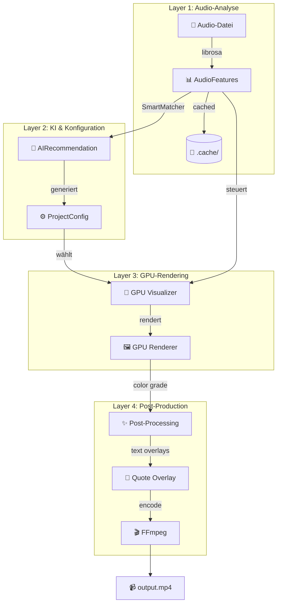
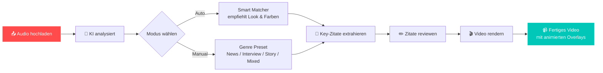

<div align="center">


# Audio Visualizer Pro

**Professionelle Audio-Visualisierung mit KI-Unterstützung und GPU-Beschleunigung**

Erstelle atemberaubende Musikvideos, Podcast-Visualisierungen und kreative Content-Videos – vollautomatisiert oder manuell gesteuert.

[](https://github.com/audio-visualizer-pro/releases)
[](https://python.org)
[](LICENSE)
[](tests/)
[](https://opengl.org)

[Schnellstart](#-schnellstart) • [Features](#-features) • [Dokumentation](#-dokumentation) • [Roadmap](#-roadmap)

</div>

---

## 📋 Inhaltsverzeichnis

- [Über dieses Projekt](#über-dieses-projekt)
- [✨ Highlights](#-highlights)
- [🚀 Schnellstart](#-schnellstart)
- [🎨 Verfügbare Visualizer](#-verfügbare-visualizer)
- [🏗️ Technische Architektur](#-technische-architektur)
- [🎙️ Podcast-Workflow](#-podcast-workflow)
- [🤖 KI-Funktionen](#-ki-funktionen)
- [⚙️ Konfiguration](#-konfiguration)
- [📁 Projektstruktur](#-projektstruktur)
- [🧪 Tests](#-tests)
- [🔧 Systemanforderungen](#-systemanforderungen)
- [🛣️ Roadmap](#-roadmap)
- [🤝 Contributing](#-contributing)
- [📄 Lizenz](#-lizenz)

---

## Über dieses Projekt

**Audio Visualizer Pro** ist eine professionelle Lösung zur automatisierten Erstellung von Musikvideos und Podcast-Visualisierungen. Das System kombiniert moderne KI-Technologie mit hardwarebeschleunigtem GPU-Rendering, um in kürzester Zeit hochwertige visuelle Inhalte zu produzieren.

**Einsatzgebiete:**
- 🎵 **Musikvideos** für Spotify, YouTube, TikTok & Instagram
- 🎙️ **Podcast-Clips** mit animierten Zitaten und Untertiteln
- 🎨 **Creative Coding** und generative Kunstprojekte
- 📊 **Präsentationen** und audiovisuelle Installationen

---

## ✨ Highlights

<table>
<tr>
<td width="50%" align="center">

### 🤖 KI-gestützte Automatisierung
Die integrierte KI analysiert dein Audio automatisch und empfiehlt den passenden Visualizer, optimale Farbpaletten und extrahiert relevante Zitate für Overlays.

</td>
<td width="50%" align="center">

### 🚀 GPU-beschleunigtes Rendering
18 verschiedene OpenGL-Visualizer rendern in Echtzeit mit 60fps – unterstützt NVIDIA, AMD und Intel-GPUs.

</td>
</tr>
<tr>
<td width="50%" align="center">

### 💬 Intelligente Zitat-Extraktion
Automatische Transkription via Google Gemini oder lokalem Whisper. Key-Zitate werden zeitgenau erkannt und als animierte Overlays eingefügt.

</td>
<td width="50%" align="center">

### ⚡ Intelligentes Caching
Audio-Analysen, Zitate und Render-Ergebnisse werden persistent gespeichert. Wiederholte Renders derselben Datei sind nahezu instantan.

</td>
</tr>
<tr>
<td width="50%" align="center">

### 🖥️ Desktop-GUI & CLI
Wähle zwischen einer modernen DearPyGui-Desktop-Oberfläche mit Live-Preview oder der flexiblen Kommandozeile für Batch-Processing.

</td>
<td width="50%" align="center">

### 🎞️ Professionelle Ausgabe
Full-HD (1920x1080) bei 60fps mit FFmpeg-Encoding. Unterstützung für h264, h265 und Apple ProRes Codecs.

</td>
</tr>
</table>

---

## 🚀 Schnellstart

### Voraussetzungen

- Python 3.10 oder höher
- FFmpeg (systemweit installiert)
- Optional: NVIDIA/AMD-GPU mit OpenGL 3.3+ Unterstützung

### Installation

```bash
# Repository klonen
git clone https://github.com/audio-visualizer-pro/audio_visualizer_pro.git
cd audio_visualizer_pro

# Virtuelle Umgebung erstellen (empfohlen)
python -m venv venv
source venv/bin/activate  # Linux/macOS
# oder: venv\Scripts\activate  # Windows

# Abhängigkeiten installieren
pip install -r requirements.txt

# FFmpeg installieren (falls nicht vorhanden)
# Ubuntu/Debian:
sudo apt-get install ffmpeg
# macOS:
brew install ffmpeg
# Windows: https://ffmpeg.org/download.html
```

### Erste Schritte

**Option A: GUI starten (empfohlen für Einsteiger)**

```bash
python start_gui.py
```

Öffnet die Desktop-Oberfläche mit Live-Preview, Parameter-Slidern und One-Click-Render.

**Option B: Kommandozeile (für Power-User)**

```bash
# Kurze Vorschau rendern (5 Sekunden, 480p)
python main.py render song.mp3 --visual pulsing_core --preview

# Vollständiges Video mit KI-Empfehlung
python main.py render podcast.mp3 --auto --output output.mp4

# Alle verfügbaren Visualizer auflisten
python main.py list-visuals
```

---

## 🏗️ Technische Architektur



### Technologie-Stack

| Komponente | Technologie | Zweck |
|------------|-------------|-------|
| **Audio-Analyse** | `librosa` | Extraktion von RMS, Onsets, Chroma-Features und Beat-Frames |
| **GPU-Rendering** | `moderngl` | OpenGL 3.3+ Shader-Pipeline für 60fps Visualisierungen |
| **Text-Rendering** | `Pillow` + GPU | Schriftarten und animierte Zitat-Overlays |
| **Video-Encoding** | `FFmpeg` | H.264/H.265/ProRes mit AAC-Audio |
| **Datenvalidierung** | `pydantic` | Typsichere Konfigurations- und Feature-Modelle |
| **GUI** | `DearPyGui` | Native Desktop-Oberfläche mit GPU-Live-Preview |
| **KI-Integration** | `Google Gemini` | Transkription und Zitat-Extraktion |
| **Offline-Transkription** | `faster-whisper` | Lokaler Fallback bei API-Ausfall |

---

## 🎨 Verfügbare Visualizer

Audio Visualizer Pro bietet **18 GPU-beschleunigte Visualizer** für verschiedene Anwendungsfälle:

### Musik-Visualisierungen

| Visualizer | Beschreibung | Geeignet für |
|------------|--------------|--------------|
| `pulsing_core` | Pulsierender Kern mit Beat-Reaktion | EDM, Pop, Trap |
| `spectrum_bars` | Klassischer 40-Balken Equalizer | Rock, Hip-Hop, Metal |
| `chroma_field` | Partikel-Feld basierend auf Tonart | Ambient, Jazz |
| `particle_swarm` | Physik-basierte Partikel-Explosionen | Dubstep, Trap, DnB |
| `neon_oscilloscope` | Retro-futuristischer Oszilloskop | Synthwave, Cyberpunk |
| `liquid_blobs` | Flüssige MetaBall-Blob-Animation | House, Techno, Deep |
| `neon_wave_circle` | Konzentrische Neon-Ringe mit Wellen | EDM, Techno |
| `frequency_flower` | Organische Blumen mit Audio-Blütenblättern | Indie, Folk, Pop |
| `bass_temple` | Bass-getriebener Tempel-Look | Drum & Bass |
| `lumina_core` | Leuchtender Kern mit Flare-Effekten | Cinematic Pop |
| `orchestral_swell` | Schwelgende Orchester-Visuals | Klassik, Filmmusik |
| `spectrum_genesis` | Kosmischer Spectrum-Genesis-Stil | Sci-Fi, Ambient |

### Sprach-Visualisierungen (Podcasts)

| Visualizer | Beschreibung | Geeignet für |
|------------|--------------|--------------|
| `typographic` | Minimalistisch mit Wellenform-Text | Podcasts, News |
| `speech_focus` | Fokussierte Sprach-Visualisierung | Interviews, Talks |
| `voice_flow` | Fließende Voice-Wellen-Animation | Storytelling |
| `sacred_mandala` | Heilige Geometrie mit Rotation | Meditation, Spiritualität |

### Universelle Effekt-Parameter

Jeder Visualizer unterstützt diese globalen Parameter:

| Parameter | Wirkung | Typischer Bereich |
|-----------|---------|-------------------|
| `brightness` | Gesamt-Helligkeit | 0.5 – 2.0 |
| `line_width` | Linien-Dicke (bei Linien-Visualizern) | 0.001 – 0.02 |
| `trail_length` | Anzahl der Echo/Trail-Frames | 0 – 12 |
| `trail_decay` | Verblass-Geschwindigkeit | 0.1 – 0.95 |

**Visualizer-spezifische Parameter** wie `pulse_intensity`, `particle_count` oder `rotation_speed` werden automatisch in der GUI angezeigt.

---

## 🎙️ Podcast-Workflow



### Zitat-Overlay-Features

- ⏱️ **Zeitbasiert**: Erscheint bei `start_time`, verschwindet bei `end_time`
- ✨ **Animiert**: Fade-In/Out, Slide-In (up/down/left/right), Scale-In, Glow-Pulse
- 🎨 **Stilvoll**: Abgerundete Box mit Schatten, Auto-Skalierung, Zeilenabstand, Hintergrund-Blur
- ✏️ **Vollständig editierbar**: Text, Start/End-Zeit, Löschen, Manuell hinzufügen — alles im GUI
- 💾 **Persistent**: Zitate werden automatisch gecacht und beim nächsten Audio-Wechsel geladen
- 🔤 **Eigene Schriftarten**: `.ttf`-Upload für Custom Branding
- 🎯 **Zeitstempel-Verfeinerung**: Automatische Korrektur an Onset-Peaks und Beat-Frames
- 💻 **Offline-Fallback**: Lokale `faster-whisper`-Transkription wenn Gemini nicht verfügbar

---

## 🤖 KI-Funktionen

Audio Visualizer Pro nutzt KI für mehrere Automatisierungsaufgaben:

### Smart Matcher – Automatische Visualizer-Empfehlung

Der **Smart Matcher** analysiert dein Audio und generiert eine optimierte Konfiguration:

```bash
# GUI: \"Auto-Modus (KI empfiehlt)\" wählen
# CLI: Mit generierter Config rendern
python main.py render podcast.mp3 --auto --output output.mp4
```

**Analysierte Audio-Features:**

| Feature | Beschreibung | Einfluss auf Visualisierung |
|---------|--------------|----------------------------|
| **RMS-Verteilung** | Lautstärke-Dynamik über Zeit | Opazität, Partikel-Intensität, Helligkeit |
| **Onset-Rate** | Häufigkeit von Anschlaggeräuschen | Trigger-Schwellen, Animationsgeschwindigkeit |
| **Tempo (BPM)** | Geschwindigkeit des Stücks | Rotationsgeschwindigkeit, Flow-Rate |
| **Key & Mode** | Tonart und Stimmung (Dur/Moll) | Farbpalette (warm/kalt, hell/dunkel) |
| **Voice-Clarity** | Sprachanteil im Audio | Visualizer-Auswahl (Sprache vs. Musik) |

**Empfohlene Einstellungen:**

- 🎨 **Visualizer**: `speech_focus` für Sprache, `spectrum_bars` für Musik
- 🌈 **Farbpalette**: Angepasst an die erkannte Tonart (z.B. C-Dur = warme Oranges)
- ⚙️ **Parameter**: Optimale Partikel-Anzahl, Geschwindigkeit, Glow-Intensität

### Zitat-Extraktion mit Google Gemini

Die KI extrahiert automatisch relevante Key-Zitate aus deinem Audio:

- **Transkription**: Vollständige Abschrift via Google Gemini API
- **Zitat-Erkennung**: Identifikation der wichtigsten Passagen mit Confidence-Score
- **Zeitstempel-Verfeinerung**: Automatische Korrektur an Onset-Peaks und Beat-Frames
- **Offline-Fallback**: Lokale `faster-whisper`-Transkription bei API-Ausfall

### Animiertes Zitat-Overlay

Extrahierte Zitate werden als professionelle Overlays ins Video eingefügt:

- ⏱️ **Zeitbasiert**: Erscheint bei `start_time`, verschwindet bei `end_time`
- ✨ **Animiert**: Fade-In/Out, Slide-In, Scale-In, Glow-Pulse Effekte
- 🎨 **Stilvoll**: Abgerundete Box mit Schatten, Auto-Skalierung, Hintergrund-Blur
- ✏️ **Editierbar**: Text, Timing und Animation manuell anpassbar
- 💾 **Persistent**: Zitate werden gecacht und beim nächsten Mal geladen
- 🔤 **Custom Fonts**: Eigene `.ttf`-Schriftarten für Branding uploadbar

---

## ⚙️ Konfiguration

### Beispiel-Config erstellen

```bash
python main.py create-config --output meine_config.json
```

### Vollständige Config-Struktur

```json
{
  "audio_file": "song.mp3",
  "output_file": "output.mp4",
  "visual": {
    "type": "pulsing_core",
    "resolution": [1920, 1080],
    "fps": 60,
    "colors": {
      "primary": "#FF0055",
      "secondary": "#00CCFF",
      "background": "#0A0A0A",
      "accent": "#FFAA00"
    },
    "params": {
      "pulse_intensity": 0.8,
      "glow_layers": 3,
      "glow_radius": 20
    }
  },
  "postprocess": {
    "contrast": 1.1,
    "saturation": 1.2,
    "brightness": 0.0,
    "warmth": 0.1,
    "film_grain": 0.05,
    "vignette": 0.3,
    "chromatic_aberration": 0.02
  },
  "quotes": [
    {
      "text": "Das ist ein Key-Zitat aus dem Audio!",
      "start_time": 10.5,
      "end_time": 15.2,
      "confidence": 0.95
    }
  ],
  "background_image": null,
  "background_blur": 0.0,
  "background_vignette": 0.0,
  "background_opacity": 0.3
}
```

---

### GPU Visual Effect Parameter

Alle GPU-Visualizer unterstützen diese universellen Effekt-Parameter, die über `params` in der Config oder via GUI-Slider gesteuert werden:

| Parameter | Bereich | Default | Beschreibung |
|-----------|---------|---------|--------------|
| `line_width` | 0.001 – 0.02 | 0.003 | Linien-Dicke (Multiplier für Linien-Visualisierungen) |
| `trail_length` | 0 – 12 | 0 | Anzahl der Echo/Trail-Frames (0 = kein Trail) |
| `trail_decay` | 0.1 – 0.95 | 0.7 | Verblass-Geschwindigkeit der Trails (höher = langsamer) |
| `brightness` | 0.5 – 2.0 | 1.0 | Gesamt-Helligkeit des finalen Bildes |

**Verwendung in der Config:**

```json
{
  "visual": {
    "type": "neon_oscilloscope",
    "params": {
      "line_thickness": 4,
      "trail_length": 8,
      "trail_decay": 0.7,
      "brightness": 1.2
    }
  }
}
```

> 💡 **Tipp:** Nicht jeder Visualizer unterstützt jeden Parameter nativ. `brightness` funktioniert jedoch garantiert in **allen** GPU-Visualizern. `line_width` wirkt sich primär auf Linien-basierte Visualizer aus (Oscilloscope, Wave Circle, Mandala), während `trail_length` bei Visualizern mit Bewegungsechos zum Tragen kommt (Oscilloscope, Wave Circle, Particle Swarm, Pulsing Core).

---

## 🧪 Tests

```bash
# Alle Tests ausführen (142 Tests)
pytest tests/ -v

# Spezifische Test-Suites
pytest tests/test_visuals.py -v       # GPU-Visualisierung
pytest tests/test_analyzer.py -v      # Audio-Feature-Extraktion
pytest tests/test_ai_matcher.py -v    # KI-Empfehlungen
pytest tests/test_quote_overlay.py -v # Text-Overlays
pytest tests/test_gemini_integration.py -v # KI-Integration
```

---

## 📁 Projektstruktur

```
audio_visualizer_pro/
├── 📂 config/                      # 14 Konfigurations-Presets
│   ├── default.json
│   ├── music_aggressive.json
│   ├── podcast_minimal.json
│   ├── podcast_news.json
│   ├── podcast_interview.json
│   ├── podcast_story.json
│   ├── podcast_mixed.json
│   └── ...
│
├── 📂 src/
│   ├── 📄 analyzer.py              # Audio-Feature-Extraktion mit Caching
│   ├── 📄 ai_matcher.py            # SmartMatcher — KI-gestützte Empfehlung
│   ├── 📄 gemini_integration.py    # Gemini API für Zitat-Extraktion
│   ├── 📄 quote_overlay.py         # Animierter Text-Overlay Renderer
│   ├── 📄 gpu_quote_renderer.py    # GPU-beschleunigtes Zitat-Rendering
│   ├── 📄 quote_cache.py           # Zitat-Persistenz & Upload-ID-Cache
│   ├── 📄 quote_refiner.py         # Zeitstempel-Verfeinerung mit Audio-Analyse
│   ├── 📄 local_transcription.py   # Lokaler Whisper-Fallback (optional)
│   ├── 📄 gpu_renderer.py          # OpenGL GPU Render-Pipeline
│   ├── 📄 gpu_preview.py           # Schneller Live-Preview (Einzel-Frame)
│   ├── 📄 gpu_text_renderer.py     # GPU-beschleunigtes Schrift-Rendering
│   ├── 📄 postprocess.py           # Color Grading & Effekte
│   ├── 📄 types.py                 # Pydantic Models & Schemas
│   ├── 📄 beat_sync.py             # Beat-Synchronisation
│   └── 📂 gpu_visualizers/         # 18 GPU-basierte Visualizer
│       ├── base.py
│       ├── pulsing_core.py
│       ├── spectrum_bars.py
│       ├── chroma_field.py
│       ├── particle_swarm.py
│       ├── typographic.py
│       ├── neon_oscilloscope.py
│       ├── sacred_mandala.py
│       ├── liquid_blobs.py
│       ├── neon_wave_circle.py
│       ├── frequency_flower.py
│       ├── bass_temple.py
│       ├── lumina_core.py
│       ├── orchestral_swell.py
│       ├── spectrum_genesis.py
│       ├── speech_focus.py
│       └── voice_flow.py
│
├── 📂 tests/                       # 142 Unit- & Integration-Tests
├── 📄 gui.py                       # DearPyGui Desktop-Interface
├── 📄 main.py                      # CLI Entry Point (click)
├── 📄 start_gui.py                 # GUI-Start-Skript
├── 📄 start_gui.bat                # Windows-Launcher
├── 📄 requirements.txt             # Python-Abhängigkeiten
├── 📄 pyproject.toml               # Projekt-Konfiguration
├── 📄 README.md                    # Diese Datei
├── 📄 QUICKSTART.md                # Schritt-für-Schritt-Anleitung
├── 📄 AGENTS.md                    # Kontext für KI-Coding-Agenten
└── 📄 LICENSE                      # MIT License
```

---

## 🔧 System-Voraussetzungen

| Komponente | Minimum | Empfohlen | Installationsbefehl |
|-----------|---------|-----------|---------------------|
| **Python** | 3.9 | 3.11+ | — |
| **FFmpeg** | 4.4 | 5.0+ | `sudo apt install ffmpeg` / `brew install ffmpeg` |
| **GPU** | Optional | NVIDIA/AMD mit OpenGL 3.3+ | — |
| **RAM** | 4 GB | 8 GB+ | — |
| **API-Key** | Optional | `GEMINI_API_KEY` | [Google AI Studio](https://aistudio.google.com/) |

> 💡 **Tipp für Windows-Nutzer**: FFmpeg muss im System-PATH verfügbar sein. Lade es von [ffmpeg.org](https://ffmpeg.org/download.html) herunter und füge den `bin`-Ordner zu PATH hinzu.

---

## 🎯 Performance-Tipps

1. 🚀 **Vorschau zuerst**: Nutze `--preview` für schnelles Testen (5 Sekunden, 480p)
2. 💾 **Caching**: Audio-Analyse wird automatisch gecached (`.cache/audio_features/`)
3. 🎞️ **Niedrigere FPS**: 30fps statt 60fps für schnelleres Rendering
4. 🤖 **KI-Auto-Modus**: Spart Zeit bei der Visualizer-Auswahl
5. 🎨 **GPU-Preview**: Nutze den GPU-Renderer für blitzschnelle Live-Vorschau in der GUI
6. ⚡ **Frame-Skip**: In der GUI: "Turbo-Modus" für schnelleres Preview-Rendering

---

## 🛣️ Roadmap

- [x] 🎨 18 GPU-Visualizer mit OpenGL
- [x] 🤖 KI-Auto-Modus (Smart Matcher)
- [x] 💬 Gemini Zitat-Extraktion mit adaptivem Confidence-Filter
- [x] ✏️ Vollständiges Zitat-CRUD (Edit, Delete, Add, Save)
- [x] 🎙️ Podcast-Genre-Presets
- [x] 🖥️ DearPyGui Desktop-GUI mit GPU-Live-Preview & dynamischen Parametern
- [x] ⚡ Aggressives Caching (Audio, Zitate, Upload-IDs)
- [x] 💾 Projekt-Preset-System (Save/Load/Auto-Save)
- [x] 🎬 FFmpeg-Hardware-Encoding (h264/h265/prores)
- [x] 💻 Lokaler Whisper-Fallback für Offline-Betrieb
- [x] 🎯 Zeitstempel-Verfeinerung via Onset/Beat-Detection
- [ ] 🌐 Web-Export (HTML5 Canvas)
- [ ] 🎚️ Echtzeit-Mikrofon-Visualizer
- [ ] 📱 Mobile-App (Flutter/React Native)
- [ ] 🔄 Batch-Rendering (Playlist-Modus)
- [ ] 🎞️ Überblendungen (Transitions zwischen Visualizern)

---

## 🤝 Contributing

Dieses Projekt lebt von Experimenten und kreativen Ideen! 🧪

### So kannst du beitragen:

- 🐛 **Bug gefunden?** Erstelle ein Issue mit Fehlermeldung und Repro-Schritten
- 💡 **Feature-Idee?** Eröffne ein Feature-Request-Issue mit Beschreibung und Use-Case
- 🎨 **Neuer Visualizer?** Nutze `python main.py create-template mein_visualizer` als Startpunkt
- 📝 **Dokumentation?** Pull Requests für README, QUICKSTART oder Code-Kommentare sind willkommen
- 🧪 **Tests?** Zusätzliche Test-Cases für Edge-Cases helfen der Stabilität

### Entwicklungs-Richtlinien

- **Sprache**: Code-Kommentare und Dokumentation auf Deutsch
- **Architektur**: Neue Visualizer erben von `BaseVisualizer` und nutzen den `@register_visualizer`-Decorator
- **Testing**: Neue Features benötigen passende Unit-Tests (`pytest tests/ -v`)
- **Code-Stil**: PEP 8, Type-Hints wo möglich, Pydantic-Models für Konfigurationen

---

## 🙏 Credits & Abhängigkeiten

Audio Visualizer Pro baut auf diesen großartigen Open-Source-Projekten auf:

| Kategorie | Projekt | Zweck |
|-----------|---------|-------|
| **Audio-Analyse** | [Librosa](https://librosa.org/) | Feature-Extraktion (RMS, Onset, Chroma, Beat) |
| **GPU-Rendering** | [ModernGL](https://moderngl.readthedocs.io/) | OpenGL 3.3+ Shader-Pipeline |
| **GUI** | [DearPyGui](https://github.com/hoffstadt/DearPyGui) | Native Desktop-Oberfläche |
| **Bildverarbeitung** | [Pillow](https://python-pillow.org/) | Text-Rendering und Bildmanipulation |
| **Video-Encoding** | [FFmpeg](https://ffmpeg.org/) | H.264/H.265/ProRes Encoding |
| **KI** | [Google Gemini](https://ai.google.dev/) | Transkription und Zitat-Extraktion |
| **Datenvalidierung** | [Pydantic](https://docs.pydantic.dev/) | Typsichere Konfigurations-Modelle |
| **CLI** | [Click](https://click.palletsprojects.com/) | Kommandozeilen-Interface |
| **Tests** | [Pytest](https://docs.pytest.org/) | Unit-Testing Framework |

---

<div align="center">

### 📄 Lizenz

Dieses Projekt steht unter der **MIT License** — siehe [LICENSE](LICENSE) für Details.

**Made with ❤️, 🤖 und 🎵 by the Audio Visualizer Pro Team**

[](https://github.com/audio-visualizer-pro/releases)
[](LICENSE)

</div>
